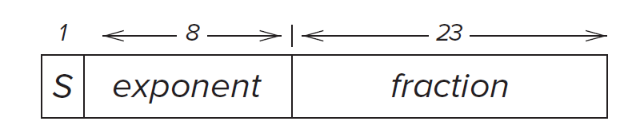

# Bits, Data Types, and Operations

Chapter 2

338 KB / 6 P / 2023-07-13

<a class="down-button" target="_blank" href="../../assets/notes/chap02.pdf" markdown="1">:fontawesome-solid-download: 下载</a>

## Overview

In this chapter, we will introduce the concept of **bits**. You will learn how to represent numbers and do some operations on that using bits.

## Bits and Data Type 

### Bits

Computers solve problems using moving electrons. Inside the computer,millions of tiny devices react to the presence or absence of voltages and thus control the moving of electrons. We simply use the presence of voltage as "1" and absence as "0". We refer to each 0 and 1 as **bit**   

### Data Type

Bits can represent data.  

Bits are just bits. Two same sequence of bits can represent different values.  

Some data types:  

* Unsigned int: the range of a $k$ digits number is [$0$,$2^k-1$]
* Signed int: the range of a k digits number is [$-2^{k-1}$,$2^{k-1}-1$]
* Logical variable
* Float
* ASCLL

## Integer Data Type

### Unsigned Integers

Represent the unsigned integers using bits.  

Recall the representation of decimal integers:  

$$
629=6*10^2+2*10^1+9*10^0
$$

Representing integers using bits is similar. Here, the base is 2, rather than 10 since one bits can only represent two different values. For example:  

$$
10_{d}=1010_b=1*2^3+0*2^2+1*2^1+0*2^0
$$

### Signed Integers 

We will introduce 3 representations of signed integers.  

#### Sign-Magnitude

A straightforward representation is as follow:  
Let the highest leading bit as the sign bit. A leading 0 signifies a positive integer and a leading 1 signifies negative integer.  

!!! Example
    +10 is represented as 01010. In the sign-magnitude representation, -10 is represented as 11010 with the highest bit changes to 1 which signifies the negative.  

#### 1's Complement

Flipping all bits of an positive integer to form a 1's complement negative integer.  

!!! Example
    +10 is represented as 01010. In the 1's complement representation, -10 is represented as 10101.

#### 2's Complement

Both of the two representations of signed integers need unnecessary hardware to do addition. In order to simplify the circuit, 2's complement representation is chosen to used on almost every computer today.  

##### How to construct?

Flipping all the bits of an positive integer and then add 1 to form a 2's complement negative integer.  

!!! Example
    +10 is represented as 01010. In the 1's complement representation, -10 is represented as 10110. 

## Conversion between Binary and Decimal

Since 2's complement is the most widely used representation, here we just consider convert 2's complement type integer. And for simplicity, we assume our number is represented in eight bits.  

### Binary to Decimal 

The procedure is in page 31  

Recall the formal of an 2's complement integer:

$$
b_7\ b_6\ b_5\ b_4\ b_3\ b_2\ b_1\ b_0
$$

The conversion procedure is as follow:  

1. Examine the leading bit $b_7$. If it is 0, go to step 2, otherwise, obtain the 2's complement positive integer with same magnitude first(flipping all the bits and adding 1).

2. Calculate magnitude:  
   $b_6*2^6+b_5*2^5+b_4*2^4+b_3*2^3+b_2*2^2+b_1*2^1+b_0*2^0$  
   In this way can we obtain the decimal magnitude.

3. Determine its sign. If the original number is negative, then just add a minus sign

### Decimal to Binary

The main idea is to divide the decimal integer by 2, and check its remainder until the dividend is 0.  

The detailed procedure is in page 32-33

### Convert Numbers with Fractional Parts

#### Binary to Decimal

Binary decimal: $0.b_{-1}b_{-2}b_{-3}b_{-4}$. Similar to convert integers

#### Decimal to Binary

The main idea is to multiply the fractional parts by two. If the result is greater than 1, than put a 1 in the binary result, otherwise put a 0. 

Note that it may take infinite steps to convert the precise fractional numbers.  

The detailed procedure is in Page 34

## Operations on Bits: Arithmetic 

### Addition and Subtraction

Addition rules still proceeds from right to left, one digit at a time.
Subtraction can be transfer to addition(i.e., A-B is simply A+(-B).).  

### Sign Extension

It's efficient to represent small number with fewer bits. However, sometimes we need to extend the bits to do some operations. The value after extension should not change. In order to maintain their original value when extending, we should follow the rules below. 

For positive numbers, just add 0 to its higher bits.

For negative numbers, just add 1 to its higher bits. 

### Overflow

Here we assume numbers are all in five-bit 2's complement form, which can represent integers from -16 to +15.

If two numbers are big enough, the result of addition would exceed the maximal number that five-bit 2's complement integer can represent. In this way, an overflow occurs.

!!! Example
   $(9+11)_d\Leftrightarrow 01001_b+01011_b=10100_b=-12_d$  
   An overflow occurs. 

!!! Info "如何判断什么时候产生溢出？"
    1. 正数+正数=负数  
    2. 负数+负数=正数  
    注意正数和负数相加永远都不会溢出

## Operations on Bits: Logical Operations

Logical operations operate on logical variables. An logical variable can have one of two values 0 and 1.

### Truth table

Truth table is a tabular listing of the values of a function for all possible combinations of values on its arguments  

We will show different logical operations via truth table.

### AND

Representation: $A\cdot B$

| A    | B    | AND  |
| ---- | ---- | ---- |
| 0    | 0    | 0    |
| 0    | 1    | 0    |
| 1    | 0    | 0    |
| 1    | 1    | 1    |

### OR

Representation: $A+B$

| A    | B    | AND  |
| ---- | ---- | ---- |
| 0    | 0    | 0    |
| 0    | 1    | 1    |
| 1    | 0    | 1    |
| 1    | 1    | 1    |

### NOT

Representation: $\bar A$

| A    | NOT  |
| ---- | ---- |
| 0    | 1    |
| 1    | 0    |

### XOR

Representation: $A\oplus B$

| A    | B    | AND  |
| ---- | ---- | ---- |
| 0    | 0    | 0    |
| 0    | 1    | 1    |
| 1    | 0    | 1    |
| 1    | 1    | 0    |

### DeMorgan's Laws

$$
\overline{\bar A\cdot\bar B} = A+B
$$

It's easy to proof this law by filling in the truth table.

## Float Point Type

If we represent fractional numbers using the way in 2.4.3, it would take more bits to represent a number which is costly. Thus, we introduce a more efficient way to represent fractional numbers.  

IEEE floating point numbers:  

IEEE floating point do not use all bits to represent the precision, instead, it allocate some bits to the range of this value. In this case, we can express larger range of values.

Below is the 32-bit IEEE floating point data type.  

* Normalized Form : $(-1)^{s}\times1.fraction\times2^{exp-bias}$ 

  Where bias = 127 in 32-bit data type, bias = 1023 in 64-bit data type.

  Note that the range of $exp$ is 1-254. $exp=1$ and $exp=255$ is used for other forms. 

* Subnormal Form: can represent small numbers than the normalized form. Here exp = 0. The form is: $(-1)^{s}\times1.fraction\times2^{1-bias}$
* Infinities: exp = 255. 
* Zero: all bits are assigned to 0.
* Other combination of fraction and exponent are all illegal.

The 64-bit IEEE floating point data type is similar to 32-bit one. The difference is 64-bit numbers have 11 bits to represent exponent and 52 bits to represent fraction.

### ASCII 

ASCII stands for America Standard Code for Information Interchange. It is used to represent characters. Each character has its own 8-bit binary digits representation. The entire set of eight-bit ASCII code is listed in Appendix E.

## Hexadecimal Notation

Hexadecimal notation provides us more convenience way to read binary string contains just 0 and 1. 

The main idea is to think each of the four bits as a unsigned integer and transfer four bits into corresponding hexadecimal number. 

!!! Example
    We have a binary string:   
    0011110101101110  
    We firstly break the string at 4-bit boundaries:  
    0011	1101	0110	1110  
    And then convert each 4-bit string to its hex digit:   
    3  D  6  E
